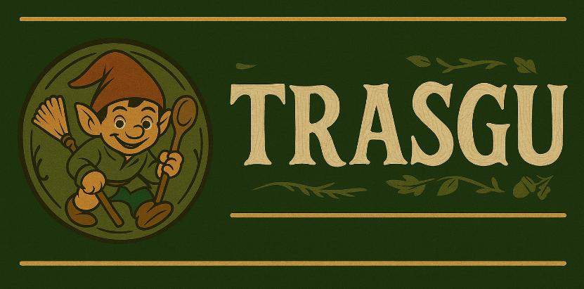

<p align="center">
  
</p>

# TFM – Modelos de PLN para el Leonés

Este repositorio contiene el trabajo desarrollado en el marco del **Trabajo de Fin de Máster (TFM)** centrado en la recopilación, procesamiento y modelado de recursos lingüísticos en **llionés (leonés)**.  

El proyecto combina la **creación de datasets propios**, su limpieza y estructuración, junto con el **entrenamiento y evaluación de modelos de lenguaje** usando frameworks modernos en Google Colab.  

**Máster en Robótica e Inteligencia Artificial**  
**Universidad de León**

---

## 📂 Estructura del repositorio

```
    ├── Dataset/                         # Recursos creados para el proyecto
    │   ├── corpus/                      # Corpus textual en llionés (textos literarios y académicos)
    │   └── dict-tr/                     # Dataset de pares Input-Output (traducciones y diccionarios)
    │
    ├── Despliegue/                      # Despliegue local vía Gradio
    │   ├── requirements.txt             # Librerías necesarias para el despliegue
    │   └── Script_Despliegue.py         # Script de despliegue (UI Gradio con modelos Trasgu)
    │
    ├── Imágenes/                        # Recursos gráficos del proyecto
    │   ├── Logo-Trasgu.png
    │   └── Banner-Trasgu.png
    │
    ├── Memoria/                         # Proyecto Overleaf en LaTeX (documento principal del TFM)
    │
    ├── Notebooks/                       # Google Colab notebooks
    │   ├── Training_Models.ipynb        # Entrenamiento
    │   ├── Testing_Models.ipynb         # Evaluación
    │   └── Server_Script.py             # Entrenamiento en servidor ULE
    │
    ├── Resultados/                      # Resultados de evaluación de los modelos
    │   ├── Modelos corpus/              # Resultados con Dataset Corpus
    │   └── Modelos dict-tr/             # Incluye resultados de 12 modelos entrenados
    │
    └── README.md
```

---

## 📊 Datasets

El proyecto ha requerido la **construcción de datasets originales** a partir de múltiples fuentes.  

### 1. 📖 Corpus
Ubicado en `Dataset/corpus/`, está el dataset [`unileon-robotics/lliones-corpus`](https://huggingface.co/datasets/unileon-robotics/lliones-corpus), el cual incluye:
- Textos literarios, etnográficos y académicos en llionés.
- Procesados a partir de **PDFs**, **OCR** y **web scraping**.
- Organización en **chunks de texto plano** listos para su uso en modelado.

### 2. 🗂️ Dict-TR
Ubicado en `Dataset/dict-tr/`, contiene el dataset [`unileon-robotics/lliones-dict-tr`](https://huggingface.co/datasets/unileon-robotics/lliones-dict-tr).  

Este dataset recopila pares *Input-Output* con traducciones, significados y vocabulario leonés-español.  

#### Descripción del dataset
El dataset **Llionés - Base de Datos Lingüística** recopila y organiza información relacionada con el idioma leonés en formato Input-Output, incluyendo:
- Traducciones.
- Vocabulario.
- Significados.
- Diccionarios.

##### Recursos utilizados:
- `lliones-esp-tr`: Traducciones de la página de **L'alderique**.  
- `lliones-semantics-and-meanings`: Vocabulario e información de **L'alderique**.  
- `lliones-dict-cele`: Diccionario del Léxico Leonés Actual (LLA).  
- `lliones-dict-faceira`: Diccionario Llionés de Nicolás Bartolomé Pérez.  

##### Agradecimientos:
- **Grupo de Robótica ULE**  
- **Cátedra de Estudios Leoneses (CELE – Universidad de León)**  
- **Asociación Faceira**  
- **Asociación Furmientu**  
- **Asociación El Fueyu**  
- **Asociación L’alderique**  

---

## 🚀 Entrenamiento de modelos

Los modelos se han entrenado en **Google Colab** utilizando la librería [Unsloth](https://github.com/unslothai/unsloth).  

- **Dataset usado:** `lliones-dict-tr` (pares Input-Output).  
- **Modelos base:** Qwen2.5 en distintas configuraciones (0.5B, 1.5B, 3B).  
- **Épocas:** 1, 3 y 5.  
- **Técnicas:** Fine-tuning y evaluación en formato GGUF.  

Los **notebooks principales** se encuentran en la carpeta `Notebooks/`:
- `Training_Models.ipynb`: entrenamiento de los modelos.  
- `Testing_Models.ipynb`: evaluación y análisis.  
- `Server_Script.py`: entrenamiento en servidor de la ULE.

---

## 🛫 Despliegue (Gradio)

Despliegue local de los modelos **Trasgu** (publicados en Hugging Face) mediante una interfaz **Gradio**.

### ✅ Requisitos
- **Python 3.10+**  

### 1) Crear entorno e instalar dependencias
```bash
# (opcional) crear y activar un entorno virtual
python -m venv .venv
# Linux / macOS
source .venv/bin/activate
# Windows (PowerShell)
.\.venv\Scripts\activate

# instalar dependencias de despliegue
pip install -r Despliegue/requirements.txt
```

### 2) Ejecutar la interfaz local
```bash
python Despliegue/Script_Despliegue.py
```

- Al arrancar, Gradio mostrará en consola una **URL local** (p. ej., `http://127.0.0.1:7860`).  
- El script descargará automáticamente los modelos **Trasgu** desde Hugging Face si no están en caché.  

---

## 📁 Resultados y modelos

**Los resultados de evaluación se encuentran en la carpeta `Resultados/`.**

---

## 🧪 Modelos `dict-tr/`
Incluye los experimentos con **12 modelos** de **Qwen2.5**:

- **9** entrenados en **Google Colab**  
  - Tamaños: **0.5B, 1.5B, 3B**  
  - Épocas: **1, 3, 5** (todas las combinaciones)
- **3** entrenados en el **servidor de la universidad**  
  - Tamaños: **0.5B, 1.5B, 3B**  
  - Épocas: **3**

### 📊 Métricas y formatos
- Cada modelo incluye métricas en **`.csv`** y **`.json`** (`lliones_eval_summary`).
- Se proporcionan variantes de cuantización: **F16** y **Q5_K_M**.

---

## 📚 Modelos `corpus/`
Contiene un **`README.md`** explicando los resultados obtenidos y detalles del corpus.

---

## 🏆 Modelos con mejores resultados (publicados en Hugging Face)
Los mejores modelos (tamaños **0.5B**, **1.5B** y **3B**) están disponibles junto con sus variantes **GGUF**:

| Tamaño | Modelo | GGUF |
|:------:|:------:|:----:|
| 0.5B | [Trasgu-0.5B](https://huggingface.co/unileon-robotics/Trasgu-0.5B) | [Trasgu-0.5B-GGUF](https://huggingface.co/unileon-robotics/Trasgu-0.5B-GGUF) |
| 1.5B | [Trasgu-1.5B](https://huggingface.co/unileon-robotics/Trasgu-1.5B) | [Trasgu-1.5B-GGUF](https://huggingface.co/unileon-robotics/Trasgu-1.5B-GGUF) |
| 3B | [Trasgu-3B](https://huggingface.co/unileon-robotics/Trasgu-3B) | [Trasgu-3B-GGUF](https://huggingface.co/unileon-robotics/Trasgu-3B-GGUF) |

> ℹ️ Cada repositorio incluye información, instrucciones de uso y los archivos necesarios para la inferencia en su respectivo formato.

---

## 📑 Memoria

En la carpeta `Memoria/` se encuentra el proyecto de **Overleaf (LaTeX)** para la redacción del documento académico del TFM.  
- Estructurado en capítulos (introducción, estado del arte, metodología, resultados y conclusiones).  
- En desarrollo para la entrega final.  

---

## 🛠️ Tecnologías utilizadas

- **Python** (procesamiento y limpieza de datos)  
- **PyMuPDF, PDFPlumber, Tesseract** (OCR y extracción de textos)  
- **BeautifulSoup / Scrapy** (web scraping)  
- **Unsloth + Google Colab** (entrenamiento de modelos)  
- **Gradio** (interfaz y despliegue local)  
- **Hugging Face** (distribución de datasets y modelos)  
- **LaTeX (Overleaf)** (redacción de la memoria)  

---

## 📌 Autor

**Julián Izquierdo García**  

Este trabajo forma parte del **Trabajo de Fin de Máster** en el área de **Procesamiento de Lenguaje Natural (PLN)** y tiene como objetivo contribuir a la preservación y digitalización del leonés mediante el uso de técnicas modernas de IA.  

---

<p align="center">
 
</p>

